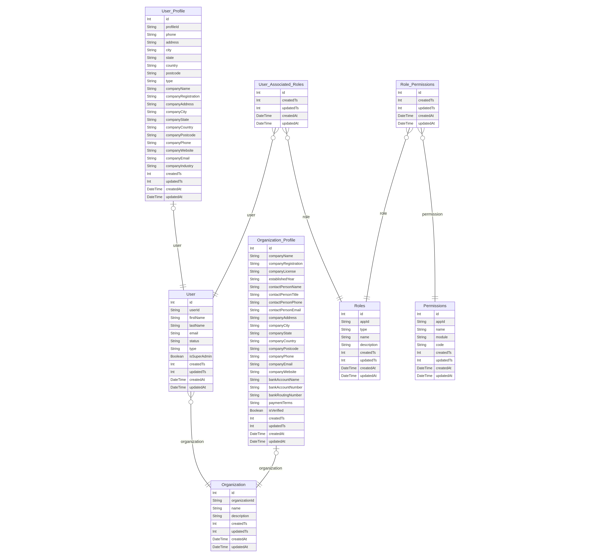

# ADRs for User & Partner Schema

## ADR 001: Separation of `Organization` and `Organization_Profile`

**Context:**
We need to support both customer-linked organizations (basic entity) and partner vendors (with extended business, financial, and verification details).

**Decision:**

* Keep a **lightweight `Organization` table** for universal entity identification.
* Store extended vendor/partner data in a dedicated `Organization_Profile`.
* Link `Organization_Profile` to `Organization` by `organizationId`.

**Consequences:**

* Clean separation of generic vs. vendor-specific attributes.
* Simplifies partner onboarding workflows without polluting `Organization` with vendor-only fields.
* Customers can belong to organizations that do not require `Organization_Profile`.

---

## ADR 002: Distinct `User` and `User_Profile` Models

**Context:**
Users may require both **core authentication data** (login, type, roles) and **extended personal or business information** (address, company details).

**Decision:**

* `User` holds system-critical identity (userId, email, type, status).
* `User_Profile` holds extended data (phone, address, company details).
* One-to-one relationship enforced via `userId`.

**Consequences:**

* Separation ensures authentication logic is lightweight.
* Profile can evolve independently (e.g., customer KYC, vendor details).
* Prevents overloading the `User` table with optional fields.

---

## ADR 003: Role-Based Access Control (RBAC) with `Roles`, `Permissions`, and Join Tables

**Context:**
The platform needs fine-grained access management for customers, partners, and system users.

**Decision:**

* Implement `Roles` (e.g., CUSTOMER, PARTNER, SYSTEM).
* Define `Permissions` for modules/features.
* Use join tables:

  * `Role_Permissions` (many-to-many between Roles and Permissions).
  * `User_Associated_Roles` (many-to-many between Users and Roles).

**Consequences:**

* Highly flexible RBAC design.
* Supports multiple roles per user.
* Enables role-permission auditing and reuse across tenants.

---

## ADR 004: Indexing & Uniqueness Constraints

**Context:**
We need to optimize queries for user lookup, organization access, and enforcement of uniqueness (e.g., emails, role-permission combos).

**Decision:**

* Unique constraints:

  * `User.email`, `User.userId`, `User_Profile.userId`, `Organization.organizationId`.
  * Composite unique keys: `Roles(type, name)`, `User_Associated_Roles(userId, roleId)`, `Role_Permissions(roleId, permissionId)`.
* Indexes on frequently queried fields: `email`, `type`, `organizationId`, `module`.

**Consequences:**

* Fast lookups for login, authorization, and organization resolution.
* Prevents duplicate roles or permissions for the same user.
* Improves scalability for high-volume multi-tenant usage.

---

## ADR 005: Status Tracking & Soft Delete Approach

**Context:**
We need lifecycle states for users/partners without physically deleting records.

**Decision:**

* Add `status` field on `User` (default `ACTIVE`).
* Use `isVerified` flag on `Organization_Profile` for vendor approval flow.
* Avoid hard deletes; rely on **soft deletes** via status flags and `isVerified`.

**Consequences:**

* Preserves audit history of users and partners.
* Supports suspension/reactivation flows without data loss.
* Aligns with compliance requirements for record retention.

---

## ADR 006: Auditability & Timestamps

**Context:**
We need to trace changes to users, organizations, and roles for compliance and debugging.

**Decision:**

* Include both integer-based timestamps (`createdTs`, `updatedTs`) and MySQL-managed fields (`createdAt`, `updatedAt`).
* Use `ON UPDATE NOW()` for automatic updates.

**Consequences:**

* Provides both system-agnostic and DB-native audit options.
* Enables synchronization with external systems that require Unix timestamps.
* Easier debugging of lifecycle events.