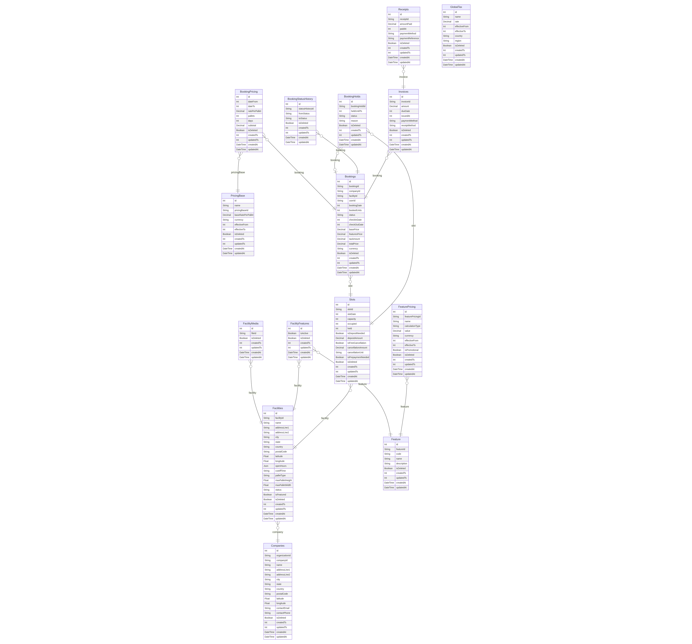

# Schema Design ADRs: Complete Database Table Documentation

## ADR-S001: Companies Table Design

**Status:** Accepted  
**Date:** Initial Schema Design  
**Deciders:** Development Team, Business Team  

### Context
We need to support multi-tenant architecture where different organizations can operate multiple pallet storage facilities. Each company needs complete address information for legal, billing, and operational purposes.

### Decision
Create `Companies` table with:

```sql
model Companies {
  id             Int     @id @default(autoincrement())
  organizationId String  // External system reference
  companyId      String  @unique // Business-friendly identifier
  name           String
  addressLine1   String
  addressLine2   String?
  city           String?
  state          String?
  country        String?
  postalCode     String?
  latitude       Float?  // For distance calculations
  longitude      Float?  // For mapping integration
  contactEmail   String?
  contactPhone   String?
  
  // Standard audit fields
  isDeleted Boolean   @default(false)
  createdTs Int?      // Unix timestamp for external systems
  updatedTs Int?      // Unix timestamp for external systems
  createdAt DateTime  @default(dbgenerated("NOW()"))
  updatedAt DateTime? @default(dbgenerated("NOW() ON UPDATE NOW()"))
}
```

**Key Design Decisions:**
- **Dual ID System:** Auto-increment `id` for internal use, `companyId` for business logic
- **Optional Address Fields:** Support for incomplete address data during registration
- **Geographic Coordinates:** Enable location-based features and distance calculations
- **External Integration:** `organizationId` for third-party system references
- **Soft Delete:** Preserve data integrity when companies are deactivated

### Consequences
- **Positive:** Flexible multi-tenancy, geographic capabilities, external system integration
- **Negative:** Optional fields require careful validation in business logic
- **Risk:** Geographic data accuracy depends on external geocoding services

---

## ADR-S002: Facilities Table Design

**Status:** Accepted  
**Date:** Initial Schema + Operational Enhancements  
**Deciders:** Operations Team, Development Team  

### Context
Facilities are the core operational units where pallet storage occurs. Each facility needs detailed operational parameters, geographic information, and physical constraints for proper inventory management.

### Decision
Design comprehensive `Facilities` table:

```sql
model Facilities {
  id              Int     @id @default(autoincrement())
  facilityId      String  @unique
  companyId       String  // FK to Companies
  name            String
  addressLine1    String
  addressLine2    String?
  city            String?
  state           String?
  country         String?
  postalCode      String?
  latitude        Float?
  longitude       Float?
  openHours       Json?   // Format: "08:00-17:00" or complex schedules
  cutoffTime      String? // Latest booking acceptance time
  palletType      String? // Standard, Cold Storage, Hazardous, etc.
  maxPalletHeight Float?  // Physical constraints
  maxPalletWidth  Float?  // Physical constraints
  status          String  @default("ACTIVE") // ACTIVE, INACTIVE, MAINTENANCE
  isFeatured      Boolean @default(false) // Marketing prominence
}
```

**Key Design Decisions:**
- **Operational Hours:** JSON field for flexible schedule definitions
- **Physical Constraints:** Height/width limits for booking validation
- **Pallet Type Classification:** Support for specialized storage types
- **Status Management:** Operational status separate from soft delete
- **Marketing Features:** Support for promotional highlighting
- **Geographic Precision:** Exact coordinates for logistics optimization

### Consequences
- **Positive:** Complete operational control, flexible scheduling, physical validation
- **Negative:** JSON field complexity, requires parsing logic
- **Benefit:** Single source of truth for facility capabilities

---

## ADR-S003: Slots Table - Time-Based Inventory Model

**Status:** Accepted  
**Date:** Core Booking System Design  
**Deciders:** Product Team, Operations Team  

### Context
Traditional inventory systems don't fit pallet storage business model where:
- Capacity is time-based (daily availability)
- Multiple bookings share the same physical space on different dates
- Holds are needed during booking process to prevent double-booking
- Cancellation and deposit policies vary by slot

### Decision
Create `Slots` table representing daily capacity units:

```sql
model Slots {
  id                 Int      @id @default(autoincrement())
  slotId             String   @unique
  facilityId         String   // FK to Facilities
  slotDate           Int      // Unix timestamp for specific date
  capacity           Int      // Maximum pallets for this date
  occupied           Int      @default(0) // Confirmed bookings
  held               Int      @default(0) // Temporary holds
  isDepositNeeded    Boolean  @default(false)
  depositAmount      Decimal? @db.Decimal(10, 2)
  isFreeCancellation Boolean  @default(false)
  cancellationAmount Decimal? @db.Decimal(10, 2)
  cancellationUnit   String?  // "HOURS", "DAYS" - cancellation window
  isPrepaymentNeeded Boolean  @default(false)
}
```

**Availability Calculation:**
```
Available = capacity - occupied - held
```

**Key Design Decisions:**
- **Date-Based Partitioning:** Each slot represents one facility-date combination
- **Triple Tracking:** Separate counters for capacity, occupied, and held inventory
- **Flexible Policies:** Per-slot deposit, cancellation, and payment rules
- **Financial Precision:** Decimal type for monetary values
- **Time Windows:** Configurable cancellation periods

### Consequences
- **Positive:** Prevents overbooking, supports complex policies, real-time availability
- **Negative:** Hold cleanup required, complex availability queries
- **Risk:** Inconsistent counts if hold cleanup fails

---

## ADR-S004: Feature and FacilityFeatures - Modular Service Architecture

**Status:** Accepted  
**Date:** Feature System Implementation  
**Deciders:** Product Team, Sales Team  

### Context
Different facilities offer different value-added services (CCTV, cold storage, 24/7 access, insurance). These features need to be:
- Configurable per facility
- Consistently defined across the platform
- Easily manageable for operations teams

### Decision
Implement master-detail feature architecture:

```sql
// Master feature definitions
model Feature {
  id          Int     @id @default(autoincrement())
  featureId   String  @unique
  code        String  @unique // e.g., "CCTV", "COLD_STORAGE", "ACCESS_24H"
  name        String  // Display name
  description String? // Customer-facing description
}

// Facility-specific feature availability
model FacilityFeatures {
  id         Int     @id @default(autoincrement())
  facilityId String  // FK to Facilities
  featureId  String  // FK to Feature
  isActive   Boolean @default(true) // Can be temporarily disabled
  
  @@unique([facilityId, featureId]) // Prevent duplicates
}
```

**Key Design Decisions:**
- **Centralized Definitions:** Single source for feature specifications
- **Code-Based Identification:** Machine-readable feature codes for business logic
- **Junction Table Pattern:** Many-to-many relationship between facilities and features
- **Activation Control:** Features can be temporarily disabled without deletion
- **Duplicate Prevention:** Unique constraint ensures data integrity

### Consequences
- **Positive:** Consistent feature definitions, flexible facility configurations
- **Negative:** Additional joins required for feature queries
- **Benefit:** Easy addition of new features platform-wide

---

## ADR-S005: FeaturePricing - Dynamic Pricing Model

**Status:** Accepted  
**Date:** Pricing System Enhancement  
**Deciders:** Finance Team, Product Team  

### Context
Feature pricing varies by:
- Calculation method (flat fee, per-pallet, percentage)
- Time periods (seasonal pricing, promotions)
- Geographic regions
- Market conditions

### Decision
Create flexible `FeaturePricing` table:

```sql
model FeaturePricing {
  id               Int     @id @default(autoincrement())
  featurePricingId String  @unique
  featureId        String  // FK to Feature
  name             String  // Pricing tier name
  calculationType  String  @default("PALLET_PER_DAY")
  value            Decimal @db.Decimal(10, 2)
  currency         String  @default("MYR")
  effectiveFrom    Int     // Unix timestamp
  effectiveTo      Int?    // Unix timestamp, null = ongoing
  isPromotional    Boolean @default(false)
}
```

**Calculation Types:**
- `FLAT`: Fixed charge regardless of quantity/duration
- `PALLET_PER_DAY`: Rate × pallets × days
- `PERCENTAGE_ON_BASE`: Percentage surcharge on base booking price

**Key Design Decisions:**
- **Time-Bound Pricing:** Support for promotional and seasonal rates
- **Multiple Calculation Methods:** Different pricing models per feature
- **Currency Specification:** Multi-currency support
- **Promotional Flagging:** Distinguish special offers from standard rates
- **Precision:** Decimal type for financial accuracy

### Consequences
- **Positive:** Highly flexible pricing, promotional capabilities, multi-currency
- **Negative:** Complex price calculation logic, potential pricing gaps
- **Risk:** Overlapping effective dates require careful management

---

## ADR-S006: PricingBase - Foundation Rate Structure

**Status:** Accepted  
**Date:** Pricing System Implementation  
**Deciders:** Finance Team, Operations Team  

### Context
Base pallet storage rates need to:
- Change over time due to market conditions
- Support promotional pricing
- Maintain historical accuracy for existing bookings
- Handle multiple currencies for international operations

### Decision
Create time-bound base pricing table:

```sql
model PricingBase {
  id                Int     @id @default(autoincrement())
  name              String  // Pricing tier description
  pricingBaseId     String  @unique
  baseRatePerPallet Decimal @db.Decimal(10, 2)
  currency          String  @default("MYR")
  effectiveFrom     Int     // Unix timestamp
  effectiveTo       Int?    // Unix timestamp, null = ongoing
}
```

**Key Design Decisions:**
- **Named Pricing Tiers:** Support for multiple rate categories
- **Time-Bound Rates:** Historical pricing preservation
- **Per-Pallet Basis:** Standardized unit pricing
- **Open-Ended Validity:** Null `effectiveTo` for current rates
- **Financial Precision:** Decimal type for monetary calculations

### Consequences
- **Positive:** Historical accuracy, flexible rate management, audit compliance
- **Negative:** Complex rate resolution logic for booking periods
- **Benefit:** Support for gradual price transitions and A/B testing

---

## ADR-S007: BookingPricing - Pricing Snapshot Architecture

**Status:** Accepted  
**Date:** Booking System Enhancement  
**Deciders:** Finance Team, Development Team  

### Context
Bookings may span multiple days with different rates, and pricing must be locked at confirmation time to prevent disputes. We need detailed breakdown for:
- Transparent billing
- Rate change handling mid-booking
- Financial auditing
- Customer service inquiries

### Decision
Create detailed pricing snapshot table:

```sql
model BookingPricing {
  id            Int     @id @default(autoincrement())
  bookingId     String  // FK to Bookings
  pricingBaseId String  // FK to PricingBase
  dateFrom      Int     // Rate application start date
  dateTo        Int     // Rate application end date
  ratePerPallet Decimal @db.Decimal(10, 2) // Snapshotted rate
  pallets       Int     // Number of pallets for this period
  days          Int     // Duration in days
  subtotal      Decimal @db.Decimal(10, 2) // rate × pallets × days
}
```

**Calculation Logic:**
```
subtotal = ratePerPallet × pallets × days
booking.basePrice = SUM(all BookingPricing.subtotal)
```

**Key Design Decisions:**
- **Period-Based Breakdown:** Support for rate changes during booking period
- **Immutable Snapshots:** Rates locked at booking confirmation
- **Detailed Audit Trail:** Complete pricing breakdown for transparency
- **Calculated Subtotals:** Pre-computed values for performance

### Consequences
- **Positive:** Pricing integrity, detailed audit trail, dispute prevention
- **Negative:** Storage overhead, complex booking modification logic
- **Benefit:** Complete pricing transparency and historical accuracy

---

## ADR-S008: Bookings - Central Reservation Entity

**Status:** Accepted  
**Date:** Core System Design + Enhancements  
**Deciders:** Product Team, Operations Team  

### Context
Bookings are the core business entity representing customer reservations. They must track:
- Complete booking details and dates
- Real-time status
- Detailed pricing breakdown
- Multi-day date ranges
- Customer and facility relationships

### Decision
Design comprehensive `Bookings` table:

```sql
model Bookings {
  id          Int    @id @default(autoincrement())
  bookingId   String @unique
  slotId      String    // FK to Slots
  companyId   String    // FK to Companies
  facilityId  String    // Denormalized for query efficiency
  userId      String    // External user reference
  bookingDate Int       // When booking was made
  bookedUnits Int       // Number of pallets booked
  status      String    @default("NEW") // NEW, HELD, CONFIRMED, CANCELLED
  
  // Multi-day booking support
  checkInDate  Int      // Start date (Unix timestamp)
  checkOutDate Int      // End date (Unix timestamp)
  
  // Aggregated pricing (calculated from related tables)
  basePrice     Decimal @db.Decimal(10, 2) // From BookingPricing
  featuresPrice Decimal @default(0) @db.Decimal(10, 2) // From BookingFeatures
  taxAmount     Decimal @default(0) @db.Decimal(10, 2) // Applied taxes
  totalPrice    Decimal @db.Decimal(10, 2) // Final amount
  currency      String  @default("MYR")
}
```

**Status Lifecycle:**
```
NEW → HELD → CONFIRMED → CANCELLED
     ↓
   EXPIRED (if hold timeout)
```

**Key Design Decisions:**
- **Multi-Day Support:** Check-in/check-out date range model
- **Denormalized Data:** `facilityId` stored for query performance
- **Aggregated Pricing:** Pre-calculated totals for efficiency
- **External User Reference:** Support for different authentication systems
- **Comprehensive Status:** Clear booking lifecycle management

### Consequences
- **Positive:** Complete booking information, efficient queries, clear lifecycle
- **Negative:** Data duplication, complex price synchronization
- **Risk:** Pricing aggregation must stay synchronized with detail tables

---

## ADR-S009: BookingHolds - Temporary Reservation System

**Status:** Accepted  
**Date:** Checkout Process Design  
**Deciders:** UX Team, Development Team  

### Context
E-commerce checkout requires temporary holds to prevent double-booking while customers complete their purchase. Holds must:
- Prevent inventory conflicts
- Expire automatically
- Convert to confirmed bookings
- Support cancellation/abandonment

### Decision
Create dedicated `BookingHolds` table:

```sql
model BookingHolds {
  id            Int     @id @default(autoincrement())
  bookingHoldId String  @unique
  bookingId     String? // Nullable until booking confirmed
  slotId        String  // FK to Slots
  heldUntilTs   Int     // Expiration timestamp
  status        String  @default("HELD") // HELD, CONFIRMED, EXPIRED, CANCELLED
  reason        String? // Why hold was created/released
}
```

**Hold Lifecycle:**
1. Create hold during checkout
2. Update `Slots.held` counter
3. Either convert to booking or expire
4. Clean up expired holds via background job

**Key Design Decisions:**
- **Time-Based Expiration:** Automatic cleanup of abandoned carts
- **Optional Booking Link:** Holds exist before booking confirmation
- **Status Tracking:** Clear hold lifecycle management
- **Reason Logging:** Audit trail for hold operations

### Consequences
- **Positive:** Prevents double-booking, supports e-commerce UX, automatic cleanup
- **Negative:** Background job required for hold cleanup
- **Risk:** Failed cleanup could permanently lock inventory

---

## ADR-S010: BookingStatusHistory - Complete Audit Trail

**Status:** Accepted  
**Date:** Audit and Compliance Requirements  
**Deciders:** Compliance Team, Customer Service Team  

### Context
Booking status changes need complete audit trail for:
- Customer service inquiries
- Dispute resolution
- Operational analytics
- Compliance reporting

### Decision
Create immutable status history table:

```sql
model BookingStatusHistory {
  id              Int    @id @default(autoincrement())
  statusHistoryId String @unique
  bookingId       String // FK to Bookings
  fromStatus      String // Previous status
  toStatus        String // New status
  // Timestamps automatically tracked in audit fields
}
```

**Usage Pattern:**
- Append-only table (no updates/deletes)
- Created on every status transition
- Includes standard timestamp fields for when change occurred

**Key Design Decisions:**
- **Immutable Records:** No updates after creation
- **Complete Transitions:** Both from and to status recorded
- **External IDs:** Business-friendly identifiers for reporting
- **Minimal Data:** Focus on status changes only

### Consequences
- **Positive:** Complete audit trail, immutable history, compliance support
- **Negative:** Storage growth over time
- **Benefit:** Reliable source for operational reporting and dispute resolution

---

## ADR-S011: GlobalTax - Automated Tax Compliance

**Status:** Accepted  
**Date:** Tax System Implementation  
**Deciders:** Finance Team, Compliance Team  

### Context
Tax calculation must handle:
- Multiple tax types (VAT, SST, Service Tax)
- Geographic variations (country/state specific)
- Time-based rate changes
- Regulatory compliance requirements

### Decision
Create comprehensive tax configuration table:

```sql
model GlobalTax {
  id            Int       @id @default(autoincrement())
  name          String    // e.g., "Malaysian SST", "Singapore GST"
  rate          Decimal   @db.Decimal(5, 2) // Percentage (6.00 = 6%)
  effectiveFrom Int       // Unix timestamp
  effectiveTo   Int?      // Unix timestamp, null = ongoing
  country       String?   // Geographic filter
  region        String?   // State/province filter
}
```

**Tax Resolution Logic:**
1. Match facility location to country/region
2. Find active tax rate for booking date
3. Apply to booking subtotal (base + features)
4. Store calculated amount in `Bookings.taxAmount`

**Key Design Decisions:**
- **Geographic Filtering:** Country and region-specific rates
- **Time-Bound Rates:** Support for tax law changes
- **Percentage Storage:** Standardized rate format
- **Optional Geography:** Global default with geographic overrides

### Consequences
- **Positive:** Automated compliance, geographic flexibility, regulatory adaptability
- **Negative:** Complex tax resolution logic, requires legal review
- **Risk:** Tax law changes require prompt system updates

---

## ADR-S012: Invoices and Receipts - Financial Document Management

**Status:** Accepted  
**Date:** Billing System Design  
**Deciders:** Finance Team, Accounting Team  

### Context
Financial operations require clear separation between:
- What customer owes (invoices)
- What customer paid (receipts)
- Support for partial payments, deposits, and payment plans

### Decision
Create separate invoice and receipt tracking:

```sql
// What customer owes
model Invoices {
  id            Int      @id @default(autoincrement())
  invoiceId     String   @unique
  bookingId     String   // FK to Bookings
  amount        Decimal  @db.Decimal(10, 2)
  dueDate       Int      // Payment deadline
  issuedAt      Int      // Invoice creation time
  paymentMethod String?  // Preferred payment method
  receiptMethod String?  // How receipt should be delivered
}

// What customer actually paid
model Receipts {
  id               Int      @id @default(autoincrement())
  receiptId        String   @unique
  invoiceId        String   // FK to Invoices
  amountPaid       Decimal  @db.Decimal(10, 2)
  paidAt           Int      // Payment timestamp
  paymentMethod    String?  // Actual payment method used
  paymentReference String?  // Transaction ID, check number, etc.
}
```

**Financial Flow:**
1. Booking confirmed → Generate invoice(s)
2. Customer pays → Create receipt(s)
3. Multiple receipts can pay one invoice (partial payments)
4. One receipt can pay multiple invoices (bulk payment)

**Key Design Decisions:**
- **Separate Concerns:** Invoices (owed) vs Receipts (paid)
- **Flexible Payments:** Support partial and bulk payments
- **Payment Tracking:** Method and reference information
- **Due Date Management:** Payment deadline enforcement

### Consequences
- **Positive:** Clear financial audit trail, flexible payment handling, accounting compliance
- **Negative:** Complex payment reconciliation logic
- **Benefit:** Accurate financial reporting and dispute resolution

---

## ADR-S013: FacilityMedia - Rich Content Management

**Status:** Accepted  
**Date:** Marketing Enhancement  
**Deciders:** Marketing Team, Sales Team  

### Context
Facilities need rich media presentation for customer decision-making:
- Multiple photos per facility
- Video content and virtual tours
- Documentation (certificates, floor plans)
- Media lifecycle separate from facility data

### Decision
Create dedicated media reference table:

```sql
model FacilityMedia {
  id         Int    @id @default(autoincrement())
  facilityId String // FK to Facilities
  fileId     String // External file storage reference
  
  // Standard audit fields for media lifecycle tracking
}
```

**Key Design Decisions:**
- **External Storage Reference:** Files stored in CDN/cloud storage
- **Multiple Media:** One-to-many relationship with facilities  
- **Separate Lifecycle:** Media can be updated without facility changes
- **Simple Structure:** Focus on core relationship, metadata in external system

### Consequences
- **Positive:** Rich facility presentation, independent media management, CDN optimization
- **Negative:** External dependency for file storage, additional infrastructure costs
- **Benefit:** Enhanced customer experience and conversion rates

---

## Schema Design Patterns Summary

### Consistent Patterns Applied Across All Tables

1. **Dual ID System:**
   - Auto-increment `id` for internal database operations
   - Business-friendly `entityId` for external references

2. **Audit Trail Fields:**
   ```sql
   isDeleted Boolean   @default(false)    // Soft delete
   createdTs Int?                         // Unix timestamp for external systems
   updatedTs Int?                         // Unix timestamp for external systems  
   createdAt DateTime  @default(...)      // MySQL timestamp
   updatedAt DateTime? @default(...)      // Auto-updating timestamp
   ```

3. **Financial Precision:**
   - `Decimal @db.Decimal(10, 2)` for monetary values
   - Currency specification where applicable

4. **Time-Bound Data:**
   - `effectiveFrom`/`effectiveTo` pattern for temporal data
   - Unix timestamps for precise time calculations

5. **Geographic Data:**
   - `latitude`/`longitude` for location-based features
   - Complete address breakdown for flexibility

6. **Status Management:**
   - Enumerated status values with clear lifecycle
   - Separate status history for audit trails

### Indexing Strategy

```sql
// Primary business identifiers
@@index([companyId])
@@index([facilityId])
@@index([bookingId])

// Foreign key relationships
@@index([facilityId, featureId])
@@index([bookingId])

// Time-based queries
@@index([effectiveFrom, effectiveTo])
@@index([checkInDate, checkOutDate])
@@index([heldUntilTs])

// Geographic queries
@@index([country, region])
```

### Data Integrity Constraints

```sql
// Prevent duplicates
@@unique([facilityId, featureId])
@@unique([companyId])

// Business logic enforcement through unique constraints
// Complex constraints handled in application logic
```

This comprehensive schema design supports a scalable, auditable, and flexible pallet storage booking platform with strong financial controls and operational capabilities.