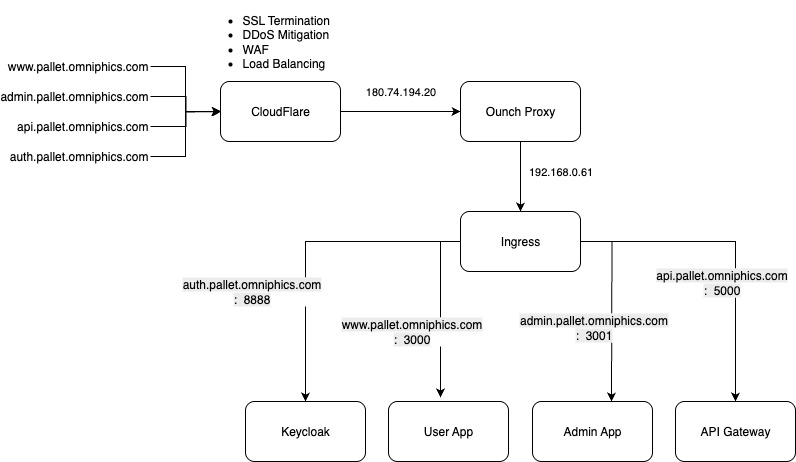

# Cloud Routing System Design

This diagram illustrates the routing and infrastructure setup for the domain `pallet.omniphics.com` and its subdomains.

## 1. Domains

* `www.pallet.omniphics.com`
* `admin.pallet.omniphics.com`
* `api.pallet.omniphics.com`
* `auth.pallet.omniphics.com`

All these domains are routed through **Cloudflare** for DNS and security.

## 2. Proxy Layer

* **Cloudflare** forwards requests to `Ounch Proxy` at IP `180.74.194.20`.
* The **Ounch Proxy** routes internal traffic to `Ingress` at `192.168.0.61`.

## 3. Ingress Routing

Ingress routes requests to the appropriate services based on the domain and port mapping:

| Domain                       | Port | Service         |
| ---------------------------- | ---- | --------------- |
| `auth.pallet.omniphics.com`  | 8888 | **Keycloak**    |
| `www.pallet.omniphics.com`   | 3000 | **User App**    |
| `admin.pallet.omniphics.com` | 3001 | **Admin App**   |
| `api.pallet.omniphics.com`   | 5000 | **API Gateway** |

## 4. Service Overview

* **Keycloak** → Authentication and Identity Management
* **User App** → Frontend application for end users
* **Admin App** → Management console for administrators
* **API Gateway** → Handles API requests