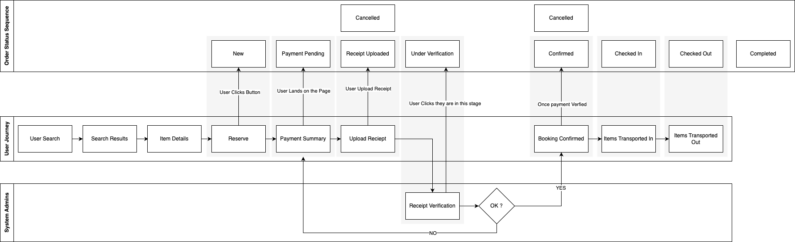

# High-Level Architecture Diagram

## Architecture Layers

### 1. Client Layer
The presentation tier consists of two main interfaces:
- **WWW (Web Application)**: Customer-facing web interface for booking and managing storage services
- **Admin Portal**: Administrative interface for system management and operations oversight

### 2. Infrastructure Layer
This layer provides core infrastructure services:
- **Web Server, Firewall, Monitoring & Logging**: Security, performance monitoring, and operational visibility
- **API Gateway**: Single entry point for all client requests, handling routing, rate limiting, and request/response transformation
- **Authentication Server**: Centralized authentication and authorization service

### 3. Microservices Layer
The business logic is distributed across specialized microservices:
- **User Service**: Manages user accounts, profiles, and user-related operations
- **Notification Service**: Handles all system notifications (email, SMS, push notifications)
- **Activity Service**: Tracks and logs all system activities and audit trails
- **Files Service**: Manages file uploads, storage, and retrieval (including receipt processing)
- **Bookings Service**: Core business logic for reservation management and booking workflows

### 4. Integration Layer
Handles external system integrations and third-party services (specific integrations not detailed in the current diagram).

### 5. Data Layer
- **Database**: Centralized data persistence layer supporting all microservices

