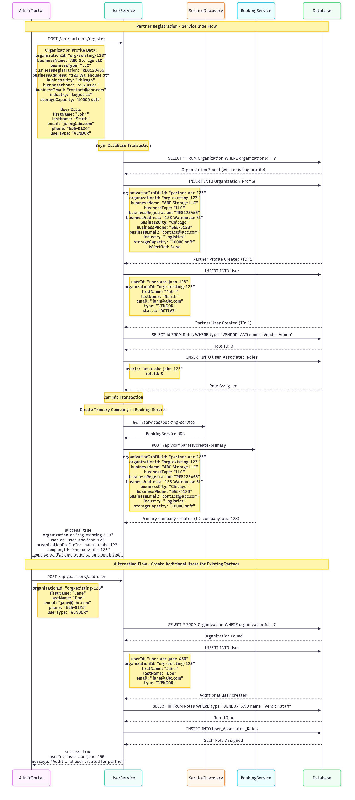

# Partner Creation Flow

### Partner Journey Flow

1. **Partner Registration (Initiation)**

   * Admin (via Admin Portal) submits a new partner registration form.
   * Includes two sets of data:

     * **Organization Profile** (business name, type, registration number, address, phone, email, industry, capacity).
     * **Primary User** (first name, last name, email, phone, `userType=VENDOR`).

2. **Validation & Transaction Start**

   * `UserService` begins a transaction.
   * Checks if the **organization profile** already exists in the system.

3. **Organization Handling**

   * If found → reuse existing `Organization_Profile`.
   * If not found → create new **Organization\_Profile** record with provided details.

4. **Primary Partner User Creation**

   * Creates a new user in **User** with type `VENDOR`.
   * Assigns role: **Vendor Admin** from the Roles table.
   * Mapping stored in **User\_Associated\_Role**.

5. **Transaction Commit**

   * Saves both organization (if new) and primary partner user in DB.

6. **Integration with Booking Service**

   * Calls `ServiceDiscovery` to locate `BookingService`.
   * Sends a `POST /api/companies/create-primary` request to create the **primary company** for this organization in BookingService.

7. **Response Delivery**

   * API returns:

     * `organizationId`, `userId`, `partnerProfileId`, `companyId`.
     * Confirmation message: **“Partner registration completed successfully.”**

---

### Partner Alternative Flow – Adding Additional Users

1. **Add Partner User Request**

   * Admin (via Admin Portal) submits form with new user details.

2. **Validation & Creation**

   * Organization lookup ensures the org exists.
   * Creates new user in **User** table with type `VENDOR`.
   * Assigns role: **Vendor Staff** from the Roles table.
   * Links user to the same `organizationId`.

3. **Response Delivery**

   * API returns the new `userId`.
   * Message: **“Additional partner user created successfully.”**

---

### Partner Status Sequence

* **Pending** → Registration request initiated.
* **Organization Profile Created** → Organization record inserted or linked.
* **Primary User Active** → Vendor Admin created and role assigned.
* **Company Created** → Corresponding company created in BookingService.
* **Additional Users Added** → Staff users created and linked to partner org.
* **Suspended** → Partner organization blocked by admin.
* **Deleted** → Partner organization soft-deleted from the system.

---