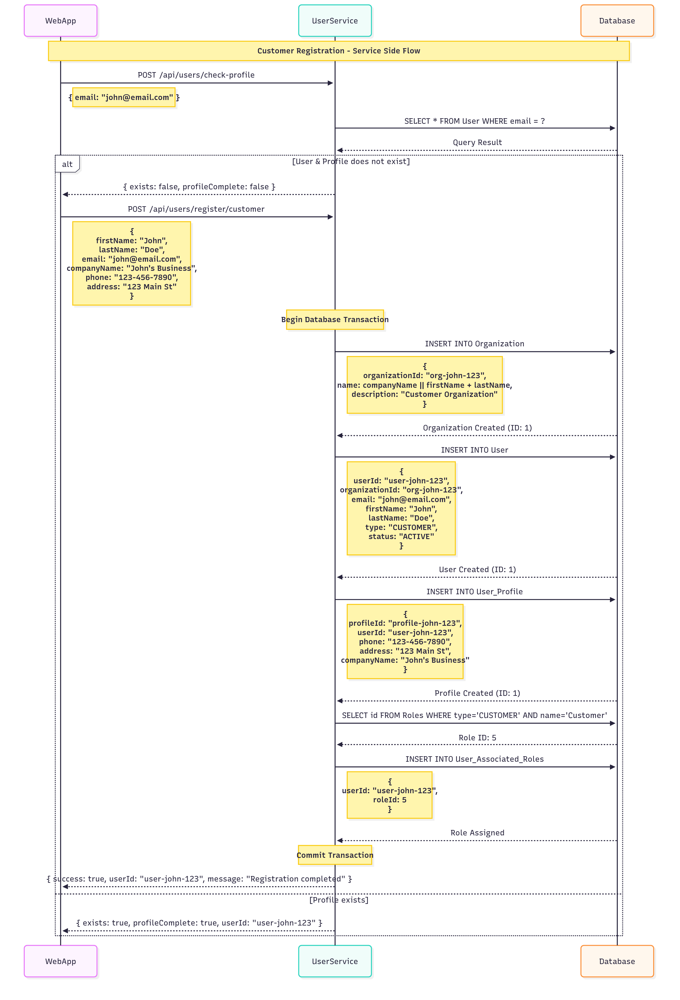

# Customer Creation Flow

### Customer Journey Flow

1. **Customer Registration (Initiation)**

   * Admin (via Admin Portal) submits a new customer registration form.
   * Information includes: name, email, phone number, address, and `userType=CUSTOMER`.

2. **Validation & Transaction Start**

   * `UserService` begins a transaction.
   * Checks if a **customer profile** already exists for the provided identifier.

3. **Customer Profile Creation**

   * If not found → a new record is inserted into **Customer\_Profile**.
   * Profile stores basic details (personal information, contact info, metadata).

4. **User Account Creation**

   * A new entry is created in the **User** table with type `CUSTOMER`.
   * A role is assigned from the **Roles table** (`CUSTOMER`).
   * Mapping stored in **User\_Associated\_Role**.

5. **Transaction Commit**

   * Once profile and user creation are successful, the transaction is committed.

6. **Response Delivery**

   * API returns:

     * `customerId`, `userId`, and `profileId`.
     * A confirmation message: **“Customer registration completed successfully.”**

---

### Customer Status Sequence

* **Pending** → Registration request received, not yet persisted.
* **Profile Created** → Customer profile record created in DB.
* **User Active** → Primary customer user account created and role assigned.
* **Additional Users Added** → (Optional) Family members or staff linked to the same customer.
* **Suspended** → Customer temporarily blocked by admin.
* **Deleted** → Customer record soft-deleted from the system.

---