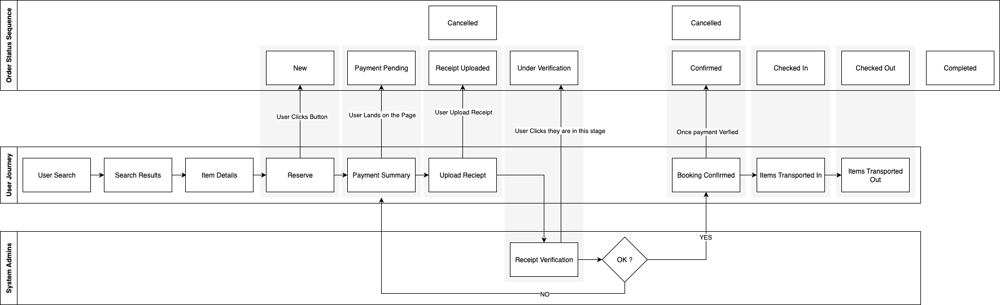

# User Journey & Booking Workflow

The system supports a comprehensive booking workflow with the following stages:

### User Journey Flow:
1. **User Search**: Users search for available storage options
2. **Search Results**: Display of available spaces and options
3. **Item Details**: Detailed view of selected storage options
4. **Reserve**: Booking reservation process
5. **Payment Summary**: Review of costs and payment details
6. **Upload Receipt**: Payment verification through receipt upload
7. **Receipt Verification**: Admin verification of payment receipts
8. **Booking Confirmation**: Final confirmation of successful booking
9. **Items Transported In**: Physical check-in of items to storage
10. **Items Transported Out**: Physical check-out of items from storage

### Order Status Sequence:
The system tracks bookings through multiple states:
- **New**: Initial booking creation
- **Payment Pending**: Awaiting payment confirmation
- **Receipt Uploaded**: Payment receipt submitted by user
- **Under Verification**: Admin reviewing payment receipt
- **Confirmed**: Booking approved and confirmed
- **Checked In**: Items physically received and stored
- **Checked Out**: Items physically retrieved
- **Completed**: Full booking lifecycle completed
- **Cancelled**: Booking cancelled (can occur at various stages)

## Key Architectural Benefits

1. **Scalability**: Microservices can be scaled independently based on demand
2. **Maintainability**: Clear separation of concerns across services
3. **Security**: Centralized authentication with API gateway providing security controls
4. **Flexibility**: Modular design allows for easy addition of new features
5. **Monitoring**: Comprehensive logging and monitoring capabilities
6. **Integration Ready**: Dedicated integration layer for external services

## Technology Considerations

- The architecture supports both customer self-service and administrative oversight
- Receipt verification workflow provides payment validation
- Activity tracking ensures full audit capability
- File service supports document management for receipts and related materials
- The system maintains state throughout the complete booking lifecycle from initial search to final completion

This architecture provides a robust foundation for a logistics and storage management platform with clear separation of concerns and comprehensive workflow support.